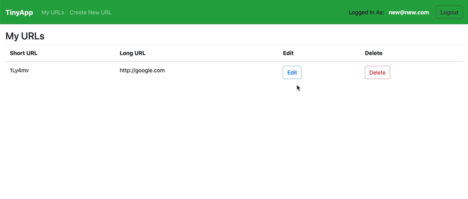

# TinyApp Project

Hello!

This is a full stack web application built with **Node** and **Express** that allows users to shorten long URLs (similar to [bitly](https://bitly.com/)). This is my first time using Node and Express.

## App Preview

### Register


---

### Create New Tiny URL


---

### Edit / Delete URL



---

### Login / Register Errors


---

### URL Errors


---

### Error Pages


## Dependencies

- Node.js
- Express
- EJS
- bcrypt
- body-parser
- cookie-session

A **package.json** file has been set up with all the dependencies needed for this app:

```json
{
  "name": "tinyapp",
  "version": "1.0.0",
  "description": "A full stack web application built with Node and Express that allows users to shorten long URLs",
  "main": "index.js",
  "scripts": {
    "test": "./node_modules/mocha/bin/mocha",
    "start": "./node_modules/.bin/nodemon -L express_server.js"
  },
  "repository": {
    "type": "git",
    "url": "git+https://github.com/aliyasser20/tinyapp.git"
  },
  "keywords": [],
  "author": "Ali Sayed",
  "license": "ISC",
  "bugs": {
    "url": "https://github.com/aliyasser20/tinyapp/issues"
  },
  "homepage": "https://github.com/aliyasser20/tinyapp#readme",
  "dependencies": {
    "bcrypt": "^4.0.1",
    "body-parser": "^1.19.0",
    "cookie-session": "^1.4.0",
    "ejs": "^3.0.1",
    "express": "^4.17.1"
  },
  "devDependencies": {
    "chai": "^4.2.0",
    "mocha": "^7.1.1",
    "nodemon": "^2.0.2"
  }
}
```

## Run Locally

1. Clone git repository
2. Install all dependencies using `npm install`
3. Run the development web server using the `npm start`
4. If needed, run **mocha** tests using the `npm test`

---

**Note**: This app was created for demo purposes only.
